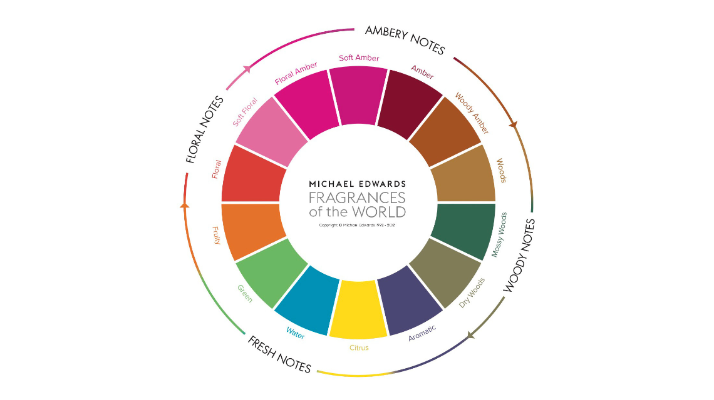
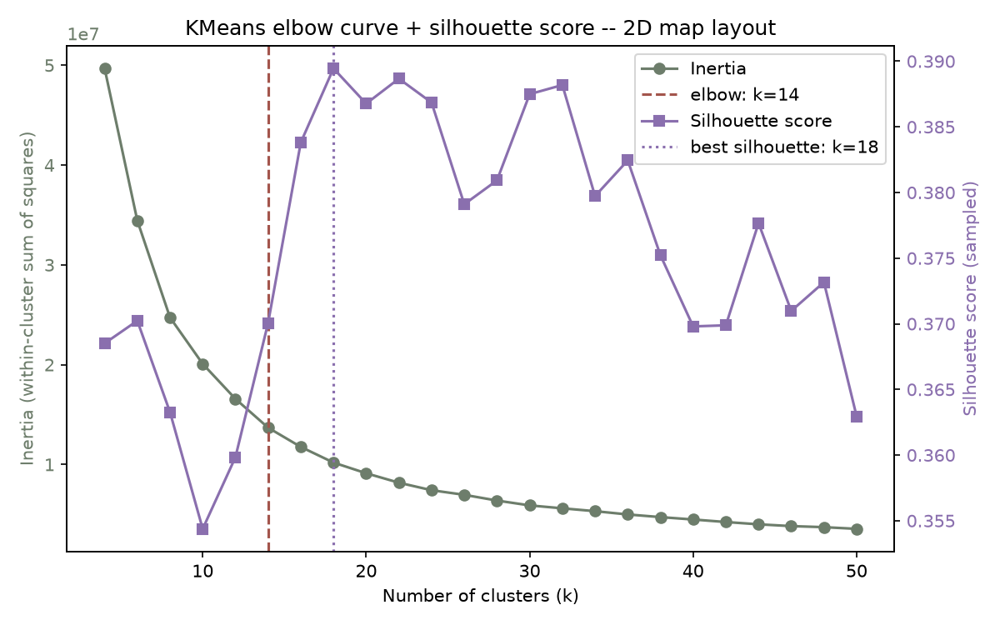
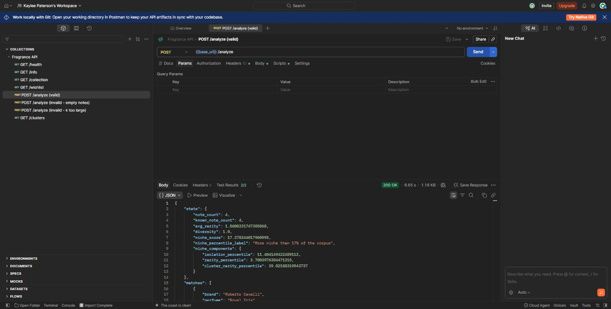
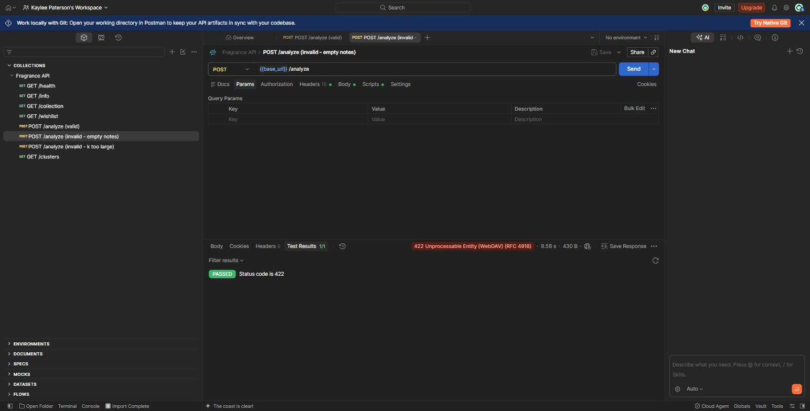

# Fragrance

Live site: https://fragrance-azure.vercel.app/

Finds perfumes with similar scent profiles by comparing their listed notes, groups the whole corpus into families from the Michael Edwards Fragrance Wheel for an interactive cluster map, and scores how "niche" any note list is relative to everything else in the corpus. Notes are converted into TF-IDF-style vectors and matched against a corpus via cosine nearest-neighbors, so "sandalwood, cardamom, iris" finds perfumes that share the same rare/common note mix rather than just an exact-string match.

## The model

The pipeline (`pipeline_def.py`) has two fitted, hand-written scikit-learn steps: `NoteFingerprint` turns a notes string into a vector, and `NicheScorer` scores how niche that vector is relative to the fitted corpus.

### `NoteFingerprint`

Turns a perfume's freeform notes string (e.g. `"sandalwood, cardamom, iris, violet, leather, ambrox, musk"`) into a sparse numeric vector, so ordinary vector-similarity search can be used to compare perfumes.

**Fitting (`fit`)** — run once, over the whole corpus (~37,000 perfumes):

1. Every notes string is split on commas, lowercased, and trimmed into a list of individual notes (`"Sandalwood, Iris"` → `["sandalwood", "iris"]`).
2. The transformer counts how often each note appears across the corpus and keeps every note that appears in **at least `min_df` perfumes** (default `min_df=2`) as its vocabulary — currently ~1,100 notes. This is a document-frequency threshold, not a fixed top-K cutoff, so long-tail real notes (e.g. "hay", "petrichor") aren't silently dropped just for being uncommon — that uncommonness is exactly the signal the niche score below needs. Only true one-offs/typos (appearing in a single perfume) are excluded.
3. Each vocabulary note gets an **inverse-document-frequency (IDF) weight**: `log(n_documents / (1 + doc_freq[note]))`. Common notes like "musk" or "vanilla" (appear in thousands of perfumes) get a low weight; distinctive notes like "ambrox" or "oud" (appear in relatively few) get a high weight.

**Transforming (`transform`)** — run per perfume, corpus or query alike:

Each perfume becomes a sparse vector of length 150. For every note in its list that's in the vocabulary, the vector's entry at that note's position is set to the note's IDF weight (everything else is 0). This is deliberately *not* term-frequency weighted — a perfume's note list has no meaningful repeat counts, so presence × rarity is what matters, not frequency.

**Matching** — `build.py` fits `NoteFingerprint` on the corpus, transforms every perfume into its vector, and indexes all of them in a scikit-learn `NearestNeighbors` (cosine metric). A query (an arbitrary note list, or a row from `collection`/`wishlist`) is transformed with the same fitted vocabulary/weights and matched against that index with cosine similarity. Because rare notes dominate the vector's magnitude, two perfumes that share a handful of unusual notes score higher than two that share only ubiquitous ones — which is closer to how someone would describe two fragrances as "similar" than plain note-overlap counting would be.

**Stats** — alongside matches, every scored perfume also gets a `describe()` breakdown:

- `note_count` — how many notes were listed
- `known_note_count` — how many of those are in the fitted vocabulary (i.e. common enough in the corpus to matter)
- `avg_rarity` — mean IDF weight of the known notes (higher = more distinctive note list)
- `diversity` — `known_note_count / note_count` (how much of the listed notes the vocabulary actually "understands")
- `niche_score`, `niche_percentile_label`, `niche_components` — see `NicheScorer` below

### `NicheScorer`

Composed after `NoteFingerprint` (`Pipeline([("fingerprint", NoteFingerprint()), ("niche", NicheScorer())])`), so it consumes the fingerprint vector directly. Scores how "niche" a fragrance is relative to the fitted corpus by combining three signals, each computed relative to the training corpus and expressed as a percentile so the numbers stay comparable regardless of raw scale:

- **Isolation** — mean cosine distance to its `k` nearest neighbors in scent-space (its own internal fitted `NearestNeighbors`). A note combination that doesn't closely resemble anything already in the database — including one you just typed in that doesn't exist yet — scores high here; a near-duplicate of an existing perfume scores low.
- **Rarity** — mean IDF weight of its matched notes (read directly off the fingerprint vector's nonzero entries, no separate lookup needed).
- **Cluster rarity** — how small its assigned cluster is, from `NicheScorer`'s own internal fitted `KMeans` (`1 - cluster_size / corpus_size`).

`fit()` learns a reference distribution for each of the three signals across the whole corpus; `transform()` converts a query's raw signals into percentiles against those references and combines them into `niche_score` (0–100, e.g. "more niche than 82% of the corpus"). It works identically for corpus rows or a brand-new query vector, since both `NearestNeighbors.kneighbors()` and `KMeans.predict()` handle held-out points natively.

### Clusters (the map)

Built by `compute_clusters()` in `build.py`, separately from the retrieval pipeline above — this is only for the `/clusters` visualization, not similarity search. The map shows two independent views of the same corpus, toggleable in the frontend, sharing the same (x, y) position for every fragrance so only the grouping/coloring changes between them:



**The classic wheel view.** Every fragrance is classified directly against the 14 named subfamilies on the **Michael Edwards Fragrance Wheel** (2010 revision) — 4 main families, Floral / Amber / Woody / Fresh, each split into 3–5 named subfamilies (`SUBFAMILY_KEYWORDS` in `build.py`), e.g. Floral splits into Floral / Soft Floral / Floral Amber. (The 2010 revision renamed the wheel's "Oriental" family to "Amber" and "Aquatic" to "Water"; this project follows that naming.) `_classify_wheel_subfamilies()` scores each fragrance's own fingerprint vector against all 14 subfamilies' keyword sets (one sparse matrix multiply: corpus vectors × a keyword indicator matrix) and assigns it to whichever scores highest — a direct per-fragrance classification, not a cluster label. An earlier version clustered the corpus first (`KMeans`) and tried to name each cluster after the fact by matching its centroid's top notes to a subfamily; that broke because subfamilies like Water or Dry Woods are almost never any single cluster's *dominant* character (they're usually a minor note under something else), so a strict one-cluster-per-subfamily mapping kept forcing a few clusters onto names that didn't match their notes at all. Classifying each fragrance directly against its own notes sidesteps that: it doesn't depend on an intermediate unsupervised grouping happening to line up with a taxonomy it was never trying to reproduce.

**The emerged-cluster view.** `KMeans` clustering on the map's own 2D layout (not the 1133-dimension note vectors — see "Picking `k`" below for why), with no knowledge of the wheel at all. Each cluster is auto-labeled by its own top 2 notes (e.g. "Oud & Patchouli") rather than matched to a wheel name, since it isn't trying to reproduce one.

Both views are colored by the *wheel's* main family (Floral/Amber/Woody/Fresh) regardless of which is active — an emerged cluster's dots can span several colors, and that mix is itself informative: it's a direct visual read on whether the data-driven grouping agrees with the classic wheel or cuts across it.

Separately, `TruncatedSVD` then `t-SNE` reduce the corpus fingerprint vectors to the 2D (x, y) layout both views are plotted on. The bundle stores per-fragrance `(x, y, wheel_label, emerged_cluster)` plus each view's own metadata (`{label, family, count}` for the 14 subfamilies, `{label, count}` for the `k` emerged clusters); `GET /clusters` samples this down to ~4,000 points (proportionally by wheel subfamily) for the frontend to render. On the map, hovering a family in the legend dims every other family's dots; hovering a label in the active view dims everything outside that group; clicking a dot (or a result in "Nearest") opens that fragrance's details, showing both its wheel subfamily and its emerged cluster side by side.

#### Picking `k` for the emerged-cluster view, and why it's clustered on the 2D layout

`k` isn't hand-picked to match the wheel's 14; it's chosen from the data, via `scripts/elbow_analysis.py`.

The first version of this analysis swept `KMeans` over the pre-embedding note vectors (k = 4..50) and tracked inertia and silhouette score (cluster separation quality). Both curves came back unusually smooth — silhouette never climbed past ~0.04 anywhere in the range, well below the ~0.1 floor usually taken as "any real cluster structure" exists — which is an honest result, not a failed analysis: perfume notes blend continuously (a fragrance can read part-floral, part-woody, part-amber all at once) rather than falling into a small number of naturally separable archetypes in their full 1133-dimension form.

That weak structure caused a second, separate problem once clusters were plotted: `KMeans` and `t-SNE` optimize different things — nearest centroid vs. preserving each point's local neighbors — so a cluster found in the 1133-dimension vector space wasn't guaranteed to land near itself on the 2D map. Hovering a cluster could light up dots scattered across the whole layout even when that cluster was a perfectly reasonable grouping in the original note-vector space, because t-SNE was never told about it and organizes the map by its own separate criteria. For a map-based visualization, a cluster that's rigorous in 1133-D but invisible on the map isn't useful to whoever's looking at it.



The fix: cluster on the map's own (x, y) coordinates directly, instead of the pre-embedding vectors. This makes "emerged cluster" and "a region you can actually see on the map" the same thing by construction — there's no second space left for the two to disagree about. Each cluster's label still comes from real notes: after `KMeans` assigns 2D memberships, `compute_clusters()` averages each cluster's members' *original* fingerprint vectors into a pseudo-centroid and takes its top notes from that. Re-running the elbow analysis on this 2D representation gives a dramatically different, much more confident picture — a clean elbow at k=14, and silhouette scores plateauing around 0.36–0.39 (solidly in "reasonable structure found" territory, roughly 10x higher than the pre-embedding analysis) rather than trailing near zero. `k=22` sits inside that plateau, a hair under the observed peak (0.3887 vs. 0.3895 at k=18) — kept for continuity with the original pick and because it stays in the same order of magnitude as the wheel's 14 subfamilies, so the two views remain comparable side by side. The trade-off, worth stating plainly: clustering the 2D layout uses less information than the full 1133-dimension vectors held (t-SNE's compression is lossy), so an emerged cluster here reflects "what visually neighbors what on this specific map" rather than an independently rigorous high-dimensional structure. For a tool whose whole product is the map, that's the right trade.

## The API

`serve.py` is a FastAPI app. On startup it loads `pipeline.joblib` — a bundle (built by `build.py`) containing the fitted two-step pipeline (`NoteFingerprint` + `NicheScorer`), a separate fitted `NearestNeighbors` index for similarity search, precomputed cluster/family data for the `/clusters` map, and the corpus documents (`brand`/`perfume`/`notes`) the indexes point into. That bundle is expensive to build (it requires the whole 37k-row corpus, KMeans, and a t-SNE layout) but cheap to load, so it's built once offline and just deserialized at request time — no per-request refitting.

| Endpoint | Method | Description |
|---|---|---|
| `/health` | GET | Liveness check; 503 if `pipeline.joblib` failed to load |
| `/info` | GET | Build metadata: corpus size, vocab size, scikit-learn version, build timestamp |
| `/collection` | GET | Rows from the Supabase `collection` table, scored live against the corpus |
| `/wishlist` | GET | Rows from the Supabase `wishlist` table, scored live against the corpus |
| `/analyze` | POST | Score an arbitrary note list against the corpus (similarity matches + niche score) |
| `/clusters` | GET | A sampled, 2D-projected view of the corpus with two groupings per fragrance: its classic Fragrance Wheel subfamily (e.g. "Dry Woods") and its emerged, data-driven cluster (e.g. "Oud & Patchouli") — colored by the wheel's main family (Floral, Amber, Woody, Fresh) either way, for the map visualization |

`/collection` and `/wishlist` query Supabase **live, on every request** — unlike the corpus, they're small (a handful of rows) and change often, so it's cheaper to fetch-then-score them per request than to keep a stale pre-scored copy in `pipeline.joblib`. Both are scored through the same `_score()` helper `/analyze` uses, so the response shape is consistent everywhere: a `stats` object (see above) plus a `matches` array of the top-`k` nearest corpus perfumes, each with `brand`, `perfume`, `notes`, and `similarity` (cosine similarity, 0–1).

`POST /analyze` request body:

```json
{ "notes": ["sandalwood", "cardamom", "iris"], "k": 5 }
```

`notes` must be 1–25 non-empty strings (each ≤ 50 chars); `k` (neighbors to return) defaults to 5 and is capped at 20. Invalid input returns `422`.

A Postman collection covering all six endpoints (including the invalid-input cases) is in `postman/scent_fingerprint.postman_collection.json`; run it with [Newman](https://github.com/postmanlabs/newman) via `newman run postman/scent_fingerprint.postman_collection.json`.

Run against the deployed Modal URL:

| `POST /analyze` — valid (200) | `POST /analyze` — invalid, empty notes (422) |
|---|---|
|  |  |

## Code layout

- `pipeline_def.py` — the `NoteFingerprint` and `NicheScorer` models (see above).
- `db.py` — Supabase client factory, used by `build.py` and `serve.py`.
- `build.py` — fits the `NoteFingerprint` → `NicheScorer` pipeline on the `perfumes` table in Supabase, builds the `NearestNeighbors` index and cluster/family layout, and dumps it all to `pipeline.joblib`.
- `serve.py` — the FastAPI app (see above).
- `modal_serve.py` — wraps `serve.py` for deployment on [Modal](https://modal.com).
- `frontend/index.html` — single-page UI that calls the deployed API.

`pipeline_def.py` must be importable identically at build time and serve time — it's how `joblib` unpickles the fitted transformer.

## Setup

```bash
python -m venv venv
venv\Scripts\activate      # or `source venv/bin/activate` on macOS/Linux
pip install -r requirements.txt
```

Set `SUPABASE_URL` and `SUPABASE_KEY` (a secret key, not the publishable key — `build.py` and `serve.py` run server-side only) in the environment before running `build.py` or `serve.py` locally.

## Build the model artifact

```bash
python build.py
```

Fits the corpus pipeline from the `perfumes` table in Supabase and writes `pipeline.joblib`. Re-run this after the corpus changes; `collection`/`wishlist` don't need a rebuild since those are queried live.

## Run the API locally

```bash
uvicorn serve:app --reload
```

## Deploy

```bash
modal deploy modal_serve.py
```

`SKLEARN_VERSION` in `modal_serve.py` must match `metadata.sklearn_version` in the built `pipeline.joblib` (printed by `build.py`) to avoid unpickling errors.

`modal_serve.py` reads Supabase credentials from a Modal secret named `fragrance-supabase`, containing `SUPABASE_URL` and `SUPABASE_KEY`:

```bash
modal secret create fragrance-supabase SUPABASE_URL=... SUPABASE_KEY=...
```

The frontend (`frontend/index.html`, deployed via Vercel) points at the deployed API through the `API_BASE` constant near the top of the file — update it after redeploying to a new Modal URL.

## Data

Data lives in Supabase, in three tables (`brand`, `perfume`, `notes` columns): `perfumes` (the corpus), `collection`, and `wishlist` (your own perfumes).

The `data/` directory holds the original CSV/XLSX files used to seed those tables — they aren't read at runtime. To (re)load Supabase from them:

```bash
python scripts/seed_supabase.py            # all three tables
python scripts/seed_supabase.py perfumes   # just one
```
